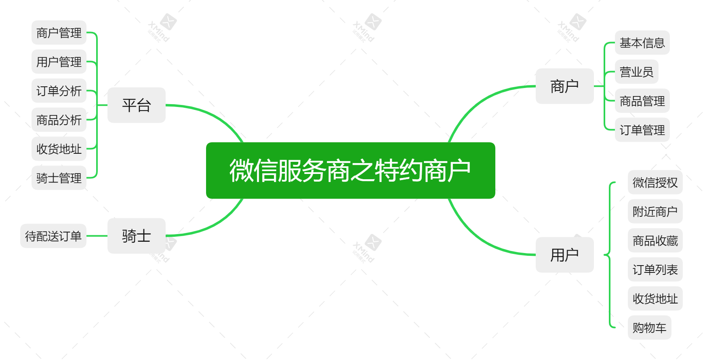

# 介绍

### 逻辑图

### 用户
1. 附近商户
2. 收藏喜欢的商品
3. 收货地址
4. 购买商品
5. 微信授权登录

### 商户
 1. 管理商品 单价、库存、图片、视频等基本信息
 2. 管理已经支付的订单 配货、发货、退货 操作
 3. 邀请营业员，并设置操作权限

### 平台
1. 规范商户
2. 食品安全
3. 文明骑士
4. 用户喜好
5. 演示地址 http://platform.1977.work/

### 骑士APP 【作者太菜不会APP开发，期待与APP大牛合作】
1. 配送订单到用户手中
